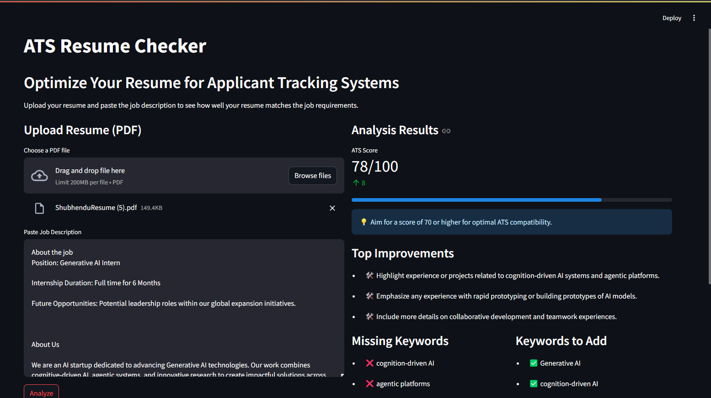

# ✨ AI-Powered ATS Resume Checker ✨



## 🚀 Tired of your resume disappearing into the black hole of ATS?

Wondering why you're not getting calls even though you're *perfect* for the job? 🤔

**Stop guessing, start knowing!** 🚀

This **AI-Powered ATS Resume Checker** is your secret weapon to crafting a resume that not only wows human recruiters but also **skyrockets** through the automated gates of ATS software. Built with cutting-edge AI from OpenAI and the user-friendly magic of Streamlit, this tool analyzes your resume against any job description to give you the **insider edge** you need.

---

## 🎯 Key Features That Will Make You Say "WOW!"

- **Instant ATS Score:** Upload your resume and paste the job description to get an immediate ATS compatibility score out of 100. Know exactly where you stand! ✅
- **Top Improvement Suggestions:** Our AI doesn't just give you a score; it tells you *exactly* how to improve! Get personalized, actionable advice to boost your resume's impact. 📈
- **Keyword Mastery:** Uncover crucial keywords you might be missing and discover powerful keywords to add. Dominate the ATS keyword game! 🔑
- **Dual Functionality:** Not just an ATS checker! We've also included a **LaTeX Resume Optimizer** (accessible via sidebar) to help you refine your beautifully crafted LaTeX resumes. ✍️
- **Effortless Input:** Simply drag and drop your PDF resume and copy-paste job descriptions directly from platforms like **LinkedIn**, Indeed, or company career pages. It's that easy! 🖱️
- **Beautiful & Intuitive Interface:** Built with Streamlit, the interface is clean, responsive, and a joy to use. Resume optimization has never been this smooth. ✨

---

## 🚀 How to Supercharge Your Resume in 3 Easy Steps

1. **Grab that Job Description:** Copy the **Job Description** text from LinkedIn, your favorite job board, or the company's career page. 📋
2. **Upload & Paste:**
   - **Upload your Resume:** Drag and drop your resume PDF or click "Browse files."
   - **Paste the Job Description:** Paste the copied job description into the text box.
3. **Analyze & Optimize:** Click "Analyze Resume" and let our AI work its magic! Within seconds, you'll receive:
   - Your **ATS Score**
   - **Top Improvements** to make
   - **Missing Keywords** to incorporate
   - **Keywords to Add** for extra impact

... and **BOOM!** 💥 You're armed with the knowledge to make your resume irresistible to ATS and recruiters alike.

---

## 🛠️ Technologies Powering This Magic

- **Streamlit:** For the sleek and user-friendly web application interface. 🎈
- **Python:** The coding backbone, making everything tick smoothly. 🐍
- **pdfplumber:** For expertly extracting text from your PDF resumes. 📄
- **OpenAI API (GPT-4o & GPT-4-turbo):** The brains of the operation! Providing intelligent ATS analysis and resume optimization. 🧠
- **dotenv:** For secure management of your API keys (because security is cool 😎).

---

## ⚙️ Getting Started (Local Setup - Optional!)

While you can likely deploy this online (instructions coming soon! 😉), here's how to run it locally:

### 1. Clone the Repo:
```sh
    git clone [YOUR_REPO_URL]
    cd [YOUR_REPO_DIRECTORY]
```

### 2. Set up your `.env` file:
Create a `.env` file in the root directory and add your OpenAI API key:
```sh
    OPENAI_API_KEY=YOUR_OPENAI_API_KEY_HERE
```
⚠️ **Important:** Keep your `.env` file secure and **never** commit it to your repository!

### 3. Install Dependencies:
```sh
    pip install -r requirements.txt
```

### 4. Run the App:
```sh
    streamlit run app.py
```

Open your browser to the URL shown in the terminal (usually `http://localhost:8501`).

---

## 📂 Repository Structure

```sh
├── assets/
│   └── screenshot.png       # (Paste your screenshot here!)
├── app.py                   # The main Streamlit application code
├── .env                     # Your API keys (keep secret!)
├── requirements.txt         # Project dependencies
├── README.md                # ✨ You are here! ✨
└── ...                      # (Any other project files)
```

---

## 🤝 Contributing

Contributions are welcome! Feel free to fork this repo, open issues, or submit pull requests to make this ATS Resume Checker even more awesome. Let's help everyone land their dream jobs! 🌟

---

## 📜 License

[Choose a License - e.g., MIT License]

---

## ❤️ Show Some Love!

If you found this tool helpful, give the repo a ⭐ star! And share it with your friends who are job hunting. Let's make resume writing less stressful and more successful! 🎉

---

## 📌 Example Code Snippet (app.py - for README reference)
```python
import streamlit as st
import pdfplumber
import json
import re
import os
from openai import OpenAI
from dotenv import load_dotenv

# ... (rest of your Python code from app.py) ...
